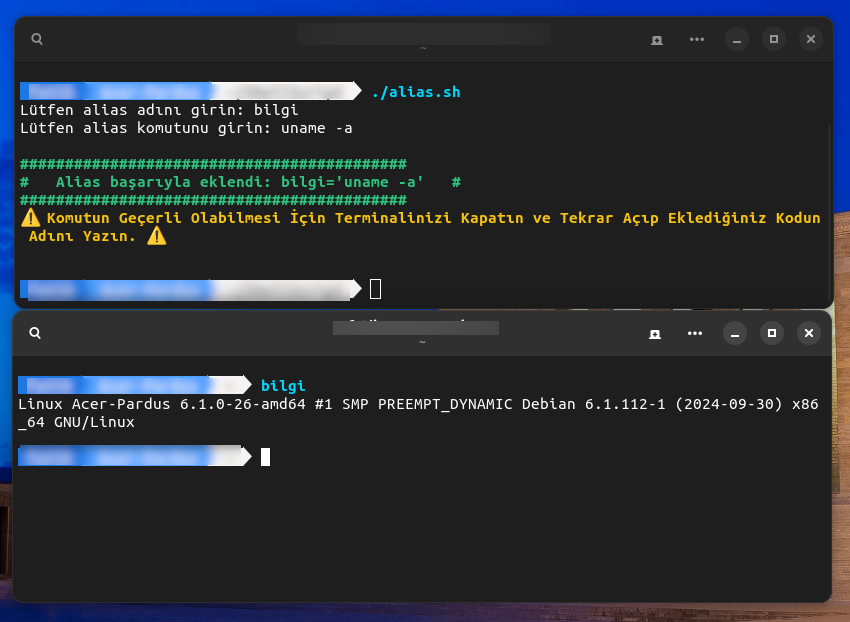

<a href="#">
    
</a>

# alias-added

A Useful ShellScript Application to Customize Terminal Scripts for Linux


Install Git Clone 

Github Package Must Be Installed On Your Device.
```bash
sudo apt install git  -y
```

----------------------------------

# Installation
Install alias-added
```bash
sudo git clone https://github.com/cektor/alias-added.git
```
```bash
cd alias-added/
```
```bash
sudo chmod +x alias.sh
```
```bash
./alias.sh
```

# Screenshot


